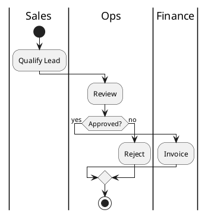

# PlantUML Cross-Functional Diagram Guide

Use this when the user requests PlantUML output or cross-functional swimlane diagrams in PlantUML.

Start with `Instructions/00b_README_MASTER.md` and `Instructions/01_authoring_contract.md`.

Use `references/` in this folder for PlantUML-specific overrides; generic BPMN rules live in the root `references/`.
Start with `references/syntax_overrides.md` for PlantUML output constraints.

## Target Output

- PlantUML activity diagram with cross-functional swimlanes.
- Top-to-bottom by default unless the user requests otherwise.

## Workflow (PlantUML)

1) Normalize to unified event schema:
   - `global_case_id`, `activity`, `timestamp`, `resource_id`.
2) Discover the model:
   - DFG for preview; Inductive Miner for final.
3) Compute metrics and variants:
   - Cycle time, wait time, throughput, variants.
4) Map to PlantUML syntax:
   - Start/Stop with `start`/`stop`.
   - Tasks as `:Task;`.
   - Gateways as `if/then/else`.
   - Lanes as `|Lane Name|`.
5) Package outputs:
   - PlantUML code + KPI summary, bottlenecks, assumptions.

## PlantUML Syntax Notes

- Use PlantUML activity diagrams with swimlanes.
- Represent lanes with `|Lane Name|` syntax.
- Keep the flow top-to-bottom unless the user requests otherwise.

Source: PlantUML activity diagram (beta) swimlanes.
https://plantuml.com/activity-diagram-beta

Note: PlantUML syntax documentation is hosted on plantuml.com; the GitHub repo does not expose user-facing syntax docs in a stable path.

## Minimal Template

## Output Checklist

- Each lane uses `|Lane Name|`.
- Gateways use `if/then/else`.
- Include a short assumptions block if lane assignments are inferred.
