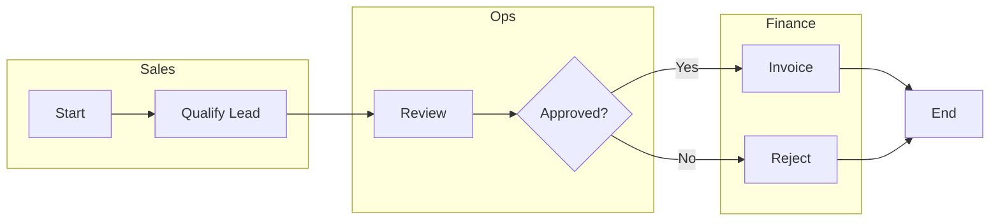

# Mermaid Cross-Functional Diagram Guide

Use this when the user requests Mermaid output or cross-functional swimlane diagrams in Mermaid.

Start with `Instructions/00b_README_MASTER.md` and `Instructions/01_authoring_contract.md`.

Use `references/` in this folder for Mermaid-specific overrides; generic BPMN rules live in the root `references/`.
Start with `references/syntax_overrides.md` for Mermaid output constraints.

## Target Output

- Mermaid `flowchart` diagram with cross-functional lanes using `subgraph`.
- Left-to-right (`LR`) by default unless the user requests otherwise.

## Workflow (Mermaid)

1) Normalize to unified event schema:
   - `global_case_id`, `activity`, `timestamp`, `resource_id`.
2) Discover the model:
   - DFG for preview; Inductive Miner for final.
3) Compute metrics and variants:
   - Cycle time, wait time, throughput, variants.
4) Map to Mermaid syntax:
   - Start/End events as nodes (e.g., `Start`, `End`).
   - Tasks as bracketed nodes (e.g., `A[Review]`).
   - Gateways as diamond nodes (e.g., `G{Approved?}`).
   - Sequence flows as arrows with optional labels.
   - Lanes as `subgraph` blocks by role/system.
5) Package outputs:
   - Mermaid code + KPI summary, bottlenecks, assumptions.

## Mermaid Syntax Notes

- Use Mermaid `flowchart` syntax.
- Represent lanes using `subgraph` blocks named for roles or systems.
- Use `direction` inside subgraphs only if needed; subgraph direction can be overridden by parent links.

Source: Mermaid flowchart syntax and subgraphs.
https://mermaid.js.org/syntax/flowchart.html

## Minimal Template

## Output Checklist

- Each lane is a `subgraph` with a clear label.
- Gateways use `{}` nodes and labeled edges.
- Include a short assumptions block if lane assignments are inferred.
